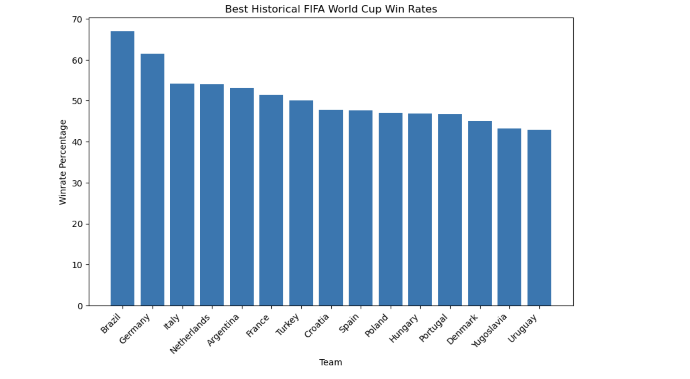
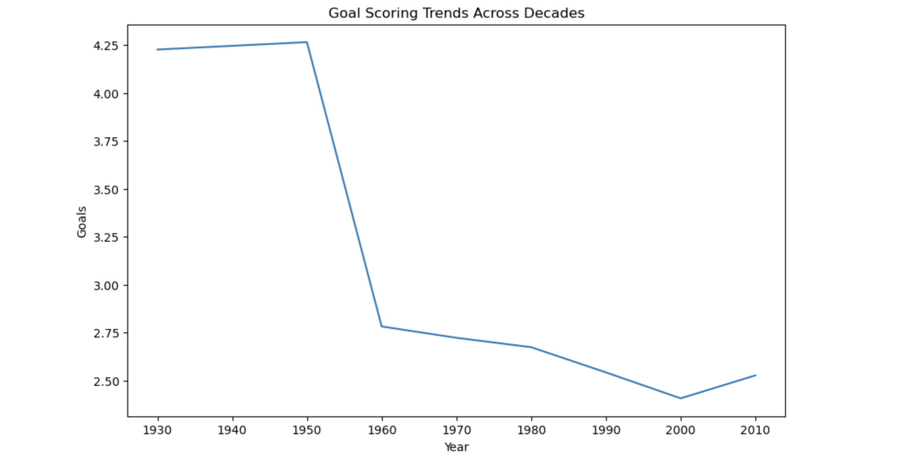

# World Cup Historical Analysis

**World Cup Historical Analysis** is a data analysis project that explores 90 years of FIFA World Cup data ahead of the 2026 tournament. The project uses Pandas for data cleaning and transformation, NumPy for conditional logic, and Matplotlib for visualizations, uncovering patterns in team performance, home advantage, goal scoring trends, and stage dominance.

---

## Features

- **Historical Win Rates:** Ranks the top 15 most successful World Cup teams by win percentage across all tournaments.
- **Host Advantage Analysis:** Compares win rates of host nations vs non-host teams to quantify the home advantage effect.
- **Goals by Stage:** Examines average goals per match at each stage to see how scoring patterns shift as stakes increase.
- **Decade Trends:** Tracks average goals per game by decade from the 1930s to the 2010s to reveal how the game has evolved.
- **Stage Dominance:** Identifies the most dominant teams separately in group stage and knockout rounds.

---

## Tech Stack

---

## Installation

1. Clone the repository: git clone https://github.com/rayyanusmanii/World-Cup-Analysis.git
2. Install the required dependencies: pip install pandas matplotlib numpy jupyter
3. Download the dataset from Kaggle: FIFA World Cup All Dataset
4. Place the four CSV files in the same folder as the notebook
5. Launch Jupyter and open analysis.ipynb: jupyter notebook
